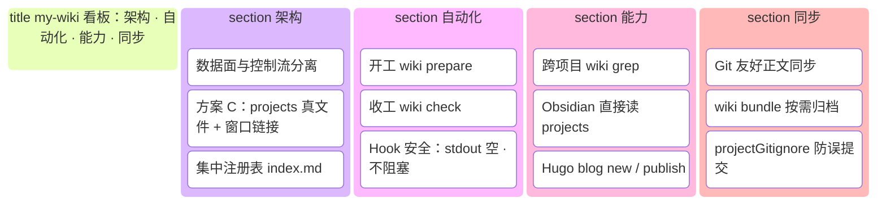
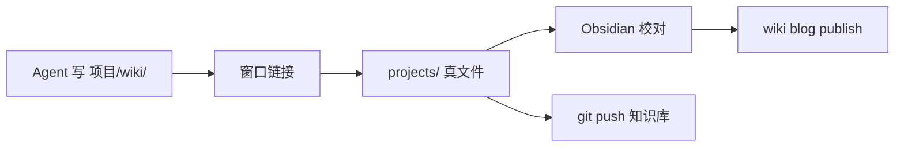

# my-wiki

**一个把散落在各项目里的调研笔记统一管起来的命令行工具**——知识正文统一落在 wiki 根（git 可同步），项目侧可用窗口链接直写（缺省）或真目录 + 增量拷贝（`--mode copy`）；双 hook 自动维护，顺带把 Hugo 博客发布的机械步骤自动化。

## 核心设计与亮点



**数据流（方案 C）**——agent 写 `项目/wiki/`，正文实际落在知识库：



| 亮点 | 一句话 |
|---|---|
| **双 hook** | 开工 `prepare` 链窗口，收工 `check` 维护——agent 无感 |
| **路径不变** | agent 仍写 `wiki/note.md`，不必知道知识库绝对路径 |
| **跨项目 grep** | `wiki grep <模式>` 一次搜全部接入项目 |
| **工具/数据分离** | 开源 CLI + 本地 `WIKI_ROOT`，个人配置不进项目 remote |

## 为什么需要它

如果你经常让 Claude Code / Codex / Qwen Code 这类 agent 做源码调研和方案分析，大概率会遇到同一个问题：产出物（调研 wiki、issue 分析、踩坑记录）散落在十几个仓库的角落里，格式不一、无人索引、想找的时候不知道在哪。为每个项目 fork 一个 wiki 仓库又太重。

my-wiki 的做法：**正文进知识库、项目留窗口**。agent 仍写 `项目/wiki/`，工具把内容存到 `WIKI_ROOT/projects/`（可 git 同步），项目侧只是一条窗口链接；注册表 `index.md` 集中登记，不会把你的个人配置带上项目 remote。任何时刻 `wiki grep` 跨项目检索，换机器 clone 知识库后 `wiki prepare` 重建窗口即可。

## 适用场景

**适合：**

- 多仓库并行调研，想在一处检索所有笔记的人
- 用 coding agent 产出文档，希望开工/收工 hook 自动维护知识目录的人
- 有个人 Hugo 博客，厌倦了手写 front matter 和手动查分类的人

**不适合：**

- 团队共享知识库——注册表是单机本地的，没有多用户同步
- 需要开箱即用的远程同步——正文在 `projects/` 里，配 private git remote 即可；也可用 `wiki bundle` 按需归档

## 依赖

| 依赖 | 何时需要 | 说明 |
|---|---|---|
| Go ≥ 1.25 | 仅自行构建时 | 唯一第三方库是 `gopkg.in/yaml.v3`，产出单二进制；也可以直接从 [Releases](../../releases) 下载对应平台的二进制（免 Go） |
| git | 仅 `blog publish` | 本地 commit + push |
| Hugo | 仅 `blog new` | 按主题 archetype 生成 front matter 模板；不在 PATH 时用 `wiki config set hugoBin` 指定 |
| 符号链接权限 | 无要求 | Linux/macOS 原生支持；Windows 无需管理员权限（自动降级为 junction） |

运行平台：Windows / Linux / macOS。

## 仓库结构

```
cmd/wiki/            入口：子命令分发与 usage
internal/cli/        共享小工具（宽容 flag 解析、字符串/路径助手）
internal/config/     配置解析：wiki 根定位、config.json、knowledgeDirs、博客仓库
internal/registry/   核心域：注册表、方案 C 存储、prepare/check/bundle
internal/view/       全局查看：ls / tree / grep / cat
internal/blog/       博客流水线：front matter、发布记录、new/publish
internal/guide/      规约引导段注入（wiki inject）
AGENTS.md            agent 规约（命令契约与工作流边界）
docs/                设计、工作流、Obsidian 接入文档（人读）
```

## 文档

- [设计文档](docs/design.md) — hook 驱动设计、数据面/控制流分离、Obsidian 校对 + Hugo 发布两个出口
- [知识工作流](docs/workflow.md) — agent 总结 → Obsidian 校对 → Hugo 发布 三段流水线
- [Obsidian 仓库接入](docs/obsidian.md) — 先建仓库 / 迁移两条路线 SOP

## 快速开始

```bash
git clone https://github.com/daidaiJ/my-wiki-repo.git
cd my-wiki-repo && go build -o wiki ./cmd/wiki

# 接入一个项目（自动发现项目下的 wiki/ 和 issues/ 目录）
./wiki init /path/to/some-project --intro "一句话介绍"

# 跨项目检索
./wiki ls                              # 已接入项目
./wiki grep "controller reconcile"     # 全局内容搜索
./wiki cat some-project/wiki/xxx.md    # 查看命中的文档
```

就这么多了。接入的项目多了之后，装上 agent 钩子（下一节），之后的一切都是自动的。

## 接入你的 Agent（双 hook）

方案 C 推荐注册 **两个 hook**，与 `wiki check` 相同的安全契约（stdout 恒空、日志走 stderr、失败不阻塞）：

| 时机 | 命令 | 作用 |
|---|---|---|
| 会话开始 | `wiki prepare` | 已注册项目：建立/修复项目侧 `wiki/` 等窗口链接 |
| 会话退出 | `wiki check` | 已注册项目：维护窗口、迁移正文、同步注册表 |

**ZCode**（`~/.zcode/cli/config.json`）：

```json
{
  "hooks": {
    "enabled": true,
    "events": {
      "Start": [
        { "hooks": [ { "type": "process", "command": "/path/to/my-wiki/wiki", "args": ["prepare"], "timeoutMs": 8000 } ] }
      ],
      "Stop": [
        { "hooks": [ { "type": "process", "command": "/path/to/my-wiki/wiki", "args": ["check"], "timeoutMs": 8000 } ] }
      ]
    }
  }
}
```

**Claude Code**（SessionStart + SessionEnd，`~/.claude/settings.json`）：

```json
{
  "hooks": {
    "SessionStart": [
      { "hooks": [ { "type": "command", "command": "/path/to/my-wiki/wiki prepare" } ] }
    ],
    "SessionEnd": [
      { "hooks": [ { "type": "command", "command": "/path/to/my-wiki/wiki check" } ] }
    ]
  }
}
```

**Qwen Code / Codex / 其他不支持钩子的工具**：用 `wiki inject` 注入规约，agent 开工前跑 `wiki prepare`、收工跑 `wiki check`。不同工具的用户级指令文件路径不同，用 `wiki config set injectFile <路径>` 配置目标（或每次 `--file` 显式指定）：

```bash
wiki config set injectFile ~/.qwen/QWEN.md   # 一次性配置目标文件
wiki inject                                   # 注入（之后 wiki inject 即可原位更新）
```

`wiki inject` 是标记锚定的：无标记则追加、有则原位替换、内容一致则跳过，重复执行安全。

## 日常使用

```bash
# 知识库
wiki init <项目> [--paths wiki,issues] [--mode copy]  # 首次接入；缺省链接模式，--mode copy 用拷贝模式
wiki init <项目> --intro "..." --summary "..."     # 事后补充/更新元数据
wiki list                                       # 项目健康度一览（含存储模式）
wiki sync [--fix]                               # 健康检查；--fix 迁移/拷贝同步并重建窗口
wiki unlink <项目> [--purge]                     # 移除注册与窗口（正文默认保留）
wiki bundle [--archive zip|tgz]                 # 按需克隆目录树/压缩归档（两种模式通用）

# 检索（路径规格：项目/链接/相对路径）
wiki ls / wiki tree <项目> / wiki grep <模式> / wiki cat <路径>

# 博客（可选功能，见下）
wiki blog list / wiki blog new ... / wiki blog publish <文件名>
```

两条规约值得知道：

- 知识目录用专用名（默认 `wiki/`、`issues/`，可配置），**不要**接入上游项目的官方 `docs/`；克隆的上游项目若自带同名目录，先删掉或整理合并——专用名归个人知识
- 每个接入目录需要一个 `README.md` 索引其中的文档（工具会持续提醒缺失的 agent 补上）

### 两种存储模式

接入时用 `--mode` 选择（或 `wiki config set defaultMode copy` 设默认），`wiki list` 可见每个项目的模式：

| | **link 模式**（缺省） | **copy 模式**（`--mode copy`） |
|---|---|---|
| 项目侧 | 窗口链接 → 知识库 | 真目录（归项目 git 管） |
| 知识库侧 | 唯一正本 | 增量合并拷贝 |
| 同步方向 | 无需同步（同一份文件） | 项目 → 知识库，mtime 新者胜，**永不删文件** |
| 项目 `.gitignore` | 写入知识目录条目 | 不写（正文随项目仓提交） |
| Obsidian 校对修改 | 直接生效 | 保留（不会被项目侧覆盖） |

**怎么选**：项目仓是自己的、希望知识随仓库走、或环境不便建符号链接 → copy；想避免两份拷贝、知识只归知识库管 → link（缺省）。两模式不支持的切换：已注册项目保留原模式，换模式需 `wiki unlink` 后重新 `init`。copy 模式的代价要知道：项目侧删除的文件会残留在知识库（不删文件是有意设计），且两侧各有一份拷贝。

## 博客发布（可选）

面向有个人 Hugo 博客的用户。`wiki config set blogRepo <仓库路径>` 后：

```bash
wiki blog list                      # 已有 categories/tags 及使用频次——新文章优先复用，防止分类碎片化
wiki blog new \
  --title "标题" --slug english-kebab \
  --categories "技术笔记" --tags "go,k8s" \
  --name my_post --file body.md     # hugo new 按主题 archetype 生成模板，CLI 填四字段+拼正文；--dry-run 预览后自动删除恢复
wiki blog publish my_post           # git add+commit+push，博客仓库的 CI 负责构建部署
```

push 失败不做重试，原始错误透传出来，人工网络环境下手动补一次 `git push` 即可（文章已本地提交）。已发布文章的四字段元数据懒维护在本地 `blog.json`。

## 进阶配置

**工具与数据分离。** 默认数据（注册表 `index.md`、发布记录 `blog.json`、配置 `config.json`、知识正文 `projects/`）就放在本仓库克隆目录；不想混在工具仓库里的话，把数据挪到别处并设置 `WIKI_ROOT` 指向它。

**用 git 管理你自己的知识。** wiki 根（Obsidian vault）加上 private remote 即可同步 `index.md`、`projects/` 正文、`blog.json`。换机器 clone 后注册 **Start/Stop** hook（`wiki prepare` + `wiki check`）重建项目侧窗口链接。`bundle/` 与 `*.zip`/`*.tar.gz` 归档输出已 gitignore。工具从不自动 push。

**配置项。** 优先级：环境变量 > `config.json`（wiki 根下，`wiki config set <键> <值>`）> 默认值。

| config.json 键 | 环境变量 | 默认 | 说明 |
|---|---|---|---|
| `blogRepo` | `WIKI_BLOG_REPO` | 无 | Hugo 博客仓库根，用博客功能必配 |
| `blogPosts` | `WIKI_BLOG_POSTS` | `<blogRepo>/pandawo/content/post` | 文章目录 |
| `hugoBin` | `WIKI_HUGO_BIN` | `hugo` | hugo 可执行文件（`blog new` 用） |
| `hugoSite` | `WIKI_HUGO_SITE` | `<blogRepo>/pandawo` | Hugo 站点目录 |
| `knowledgeDirs` | `WIKI_KNOWLEDGE_DIRS` | `wiki, issues` | 知识目录类型名 |
| `projectGitignore` | `WIKI_PROJECT_GITIGNORE` | `true` | 是否在项目仓创建/追加知识目录 `.gitignore`（仅 link 模式） |
| `defaultMode` | `WIKI_DEFAULT_MODE` | `link` | 新项目接入的存储模式：`link` / `copy` |
| `injectFile` | `WIKI_INJECT_FILE` | `~/.qwen/QWEN.md` | `wiki inject` 的目标指令文件（各 agent 工具路径不同） |
| — | `WIKI_ROOT` | 见解析顺序 | wiki 数据根目录 |

完整的 agent 规约与命令契约见 [AGENTS.md](AGENTS.md)。
