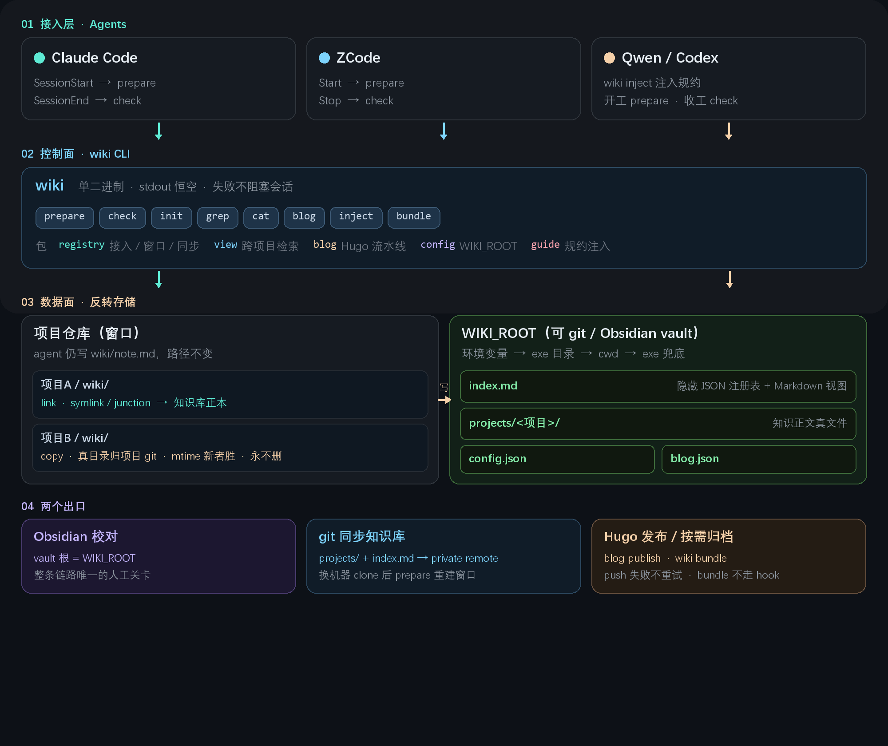
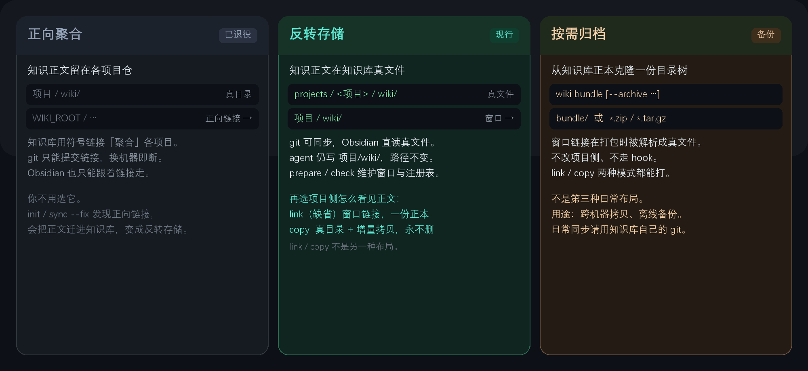

> [English](README.en.md)

# my-wiki

[](https://github.com/daidaiJ/my-wiki-repo/actions/workflows/ci.yml)
[](https://github.com/daidaiJ/my-wiki-repo/releases/latest)
[](go.mod)
[](LICENSE)

**一个把散落在各项目里的调研笔记统一管起来的命令行工具。** 知识正文统一落在 wiki 根（git 可同步），项目侧可用窗口链接直写（缺省）或真目录 + 增量拷贝（`--mode copy`）；收工 hook 自动维护，顺带把 Hugo 博客发布的机械步骤自动化。

## 架构

四层：**接入层**（Claude / ZCode / Qwen）经收工 hook 打到 **控制面**（开源 `wiki` CLI）；agent 仍写 `项目/wiki/`，正文经窗口落到 **数据面** `WIKI_ROOT/projects/`；出口是 Obsidian 校对、git 同步、Hugo 发布。



| 层 | 做什么 |
|---|---|
| **接入** | Claude Code / ZCode / Qwen Code / 其他 agent |
| **控制面** | `wiki` CLI：init / check / grep / blog |
| **数据面** | `WIKI_ROOT`：注册表 `index.md`、`projects/` 正文、`config.json` |
| **出口** | Obsidian 校对 · git 同步 · Hugo 发布 |

## 📖 文档

| 读者 | 文档 | 说明 |
|---|---|---|
| 🤖 AI Agent | [docs/AGENT_GUIDE.md](docs/AGENT_GUIDE.md) | 省 token 版：命令、hook、配置、发布硬规则 |
| 👤 人类用户 | [docs/HUMAN_GUIDE.md](docs/HUMAN_GUIDE.md) | 易读版：安装、hook、日常使用、配置速查、博客 |
| 🔍 设计 | [docs/design.md](docs/design.md) | hook 驱动、数据面/控制流分离、link / copy |
| 🔄 工作流 | [docs/workflow.md](docs/workflow.md) | agent 总结 → Obsidian 校对 → Hugo 发布 |
| 📓 Obsidian | [docs/obsidian.md](docs/obsidian.md) | 先建仓库 / 迁移两条路线 SOP |

各文档均为中文默认，同名 `.en.md` 为英文版。

## ✨ 核心特性

| 亮点 | 一句话 |
|---|---|
| **单 hook** | 收工 `check` 维护窗口、新增知识目录动态并入、未注册项目按需自动反转——agent 无感 |
| **路径不变** | agent 仍写 `wiki/note.md`，不必知道知识库绝对路径 |
| **跨项目 grep** | `wiki grep <模式>` 一次搜全部接入项目 |
| **VSCode 预览** | `projects/` 自动补齐 `.vscode` 配置，点开 `.md` 直接是渲染视图 |
| **工具/数据分离** | 开源 CLI + 本地 `WIKI_ROOT`，个人配置不进项目 remote |

## 为什么需要它

如果你经常让 Claude Code / Codex / Qwen Code 这类 agent 做源码调研和方案分析，大概率会遇到同一个问题：产出物（调研 wiki、issue 分析、踩坑记录）散落在十几个仓库的角落里，格式不一、无人索引、想找的时候不知道在哪。为每个项目 fork 一个 wiki 仓库又太重。

my-wiki 的做法：**正文进知识库、项目留窗口**。agent 仍写 `项目/wiki/`，工具把内容存到 `WIKI_ROOT/projects/`（可 git 同步），项目侧只是一条窗口链接；注册表 `index.md` 集中登记，不会把你的个人配置带上项目 remote。任何时刻 `wiki grep` 跨项目检索，换机器 clone 知识库后 `wiki prepare` 重建窗口即可。

**适合：** 多仓库并行调研、用 coding agent 产出文档并希望收工 hook 自动维护、有个人 Hugo 博客不想手写 front matter。

**不适合：** 团队共享知识库（注册表是单机本地的）；需要开箱即用的远程同步——正文在 `projects/` 里，配 private git remote 即可，也可用 `wiki bundle` 按需归档。

## 正文放哪

现行做法是**反转存储**：知识正文是知识库里的真文件，项目侧只留窗口。另外两种布局不是选项——**正向聚合**已退役（遇到会自动迁走），**按需归档**只是备份出口。



文档只写反转存储，是因为只有它是活布局。正向聚合会自动迁移；按需归档不是第三种日常模式，只是 `wiki bundle` 从知识库正本打一份可带走的拷贝。**link / copy** 是反转存储里「项目侧怎么看见正文」的两种形态，不是另一套布局。对照表见 [设计文档](docs/design.md)。

## 🚀 快速开始

```bash
git clone https://github.com/daidaiJ/my-wiki-repo.git
cd my-wiki-repo && go build -o wiki ./cmd/wiki

# 接入一个项目（自动发现项目下的 wiki/ 和 issues/ 目录）
./wiki init /path/to/some-project --intro "一句话介绍"

# 跨项目检索
./wiki ls                              # 已接入项目
./wiki grep "controller reconcile"     # 全局内容搜索
./wiki cat some-project/wiki/xxx.md    # 查看命中的文档
```

详细配置、hook 与日常命令见上方两份指南。

## License

MIT License，见 [LICENSE](LICENSE)。
