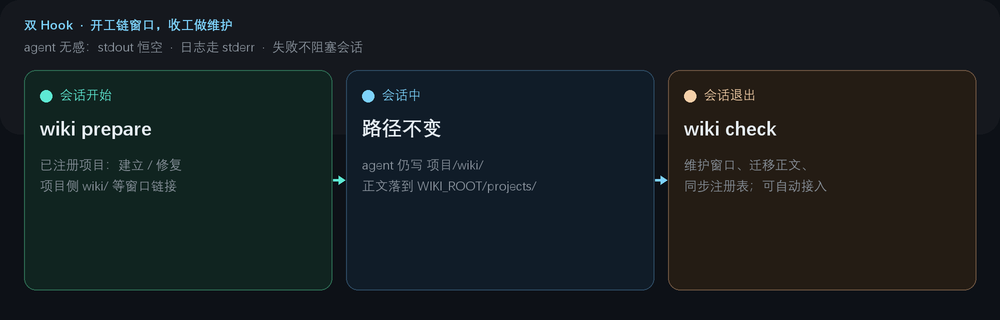

> [中文版](HUMAN_GUIDE.md)

# HUMAN_GUIDE — Setup and Usage (Human-Readable)

This guide is for **human users**: install, agent hooks, daily use, and configuration. For the token-efficient agent version see [AGENT_GUIDE.en.md](AGENT_GUIDE.en.md).

## Dependencies

| Dependency | When | Notes |
|---|---|---|
| Go ≥ 1.25 | Build from source only | Sole third-party lib is `gopkg.in/yaml.v3`; single binary. Or download from [Releases](../../releases) (no Go required). |
| git | `blog publish` only | Local commit + push |
| Hugo | `blog new` only | Theme archetype for front matter. If not on PATH: `wiki config set hugoBin` |
| Symlink permission | Not required | Native on Linux/macOS; Windows falls back to junctions (no admin) |

Platforms: Windows / Linux / macOS.

## Quick start

```bash
git clone https://github.com/daidaiJ/my-wiki-repo.git
cd my-wiki-repo && go build -o wiki ./cmd/wiki

# Register a project (auto-discovers wiki/ and issues/ under it)
./wiki init /path/to/some-project --intro "one-line intro"

# Cross-project search
./wiki ls                              # registered projects
./wiki grep "controller reconcile"     # content search
./wiki cat some-project/wiki/xxx.md    # read a hit
```

Keep personal data out of the tool repo: point `WIKI_ROOT` at a separate directory (can also be an Obsidian vault). See “Tool vs data” below and [obsidian.en.md](obsidian.en.md).

## Agent hook (single hook)

Register **one hook** only: session-end `wiki check`. Contract: empty stdout, logs on stderr, failures never block the session.



| When | Command | What it does |
|---|---|---|
| Session end (the only hook) | `wiki check` | Registered projects: maintain windows, migrate notes, sync the registry. Unregistered projects that already have knowledge dirs → auto-enroll (only after the agent has written something; never pre-create empty dirs). **Behavior follows `defaultMode`**: `link` (default) = invert (move notes into the wiki, replace in place with a window); `copy` = project keeps real dirs, hook does project→wiki incremental merge copies |

Scope is `hookMode`: `forbiddenList` (default) applies everywhere except `forbiddenPaths` (the entry and any descendant); `whitelist` applies only under `includePaths`. Skips log a reason to stderr.

**ZCode** (`~/.zcode/cli/config.json`):

```json
{
  "hooks": {
    "enabled": true,
    "events": {
      "Stop": [
        { "hooks": [ { "type": "process", "command": "/path/to/my-wiki/wiki", "args": ["check"], "timeoutMs": 8000 } ] }
      ]
    }
  }
}
```

**Claude Code** (`~/.claude/settings.json`):

```json
{
  "hooks": {
    "SessionEnd": [
      { "hooks": [ { "type": "command", "command": "/path/to/my-wiki/wiki check" } ] }
    ]
  }
}
```

**Qwen Code / Codex / tools without hooks**: `wiki inject` the convention; the agent runs `wiki check` at session end. User-level instruction paths differ per tool — set the target with `wiki config set injectFile <path>` (or pass `--file` each time):

```bash
wiki config set injectFile ~/.qwen/QWEN.md   # once
wiki inject                                   # inject (later runs update in place)
```

`wiki inject` is marker-anchored: append if missing, replace in place if present, skip if unchanged. Safe to re-run.

## Daily use

```bash
# Knowledge base
wiki init <project> [--paths wiki,issues] [--mode copy]  # first enroll; link by default
wiki init <project> --intro "..." --summary "..."     # fill / update metadata later
wiki list                                       # health overview (includes storage mode)
wiki sync [--fix]                               # health check; --fix migrates/copies and rebuilds windows
wiki unlink <project> [--purge]                 # drop registration + windows (notes kept by default)
wiki bundle [--archive zip|tgz]                 # on-demand archive from the wiki canonical tree

# Search (path shape: project/link/relative)
wiki ls / wiki tree <project> / wiki grep <pattern> / wiki cat <path>

# Blog (optional; see below)
wiki blog list / wiki blog new ... / wiki blog publish <filename>
```

Two conventions:

- Knowledge dirs use dedicated names (default `wiki/`, `issues/`, configurable). **Do not** enroll upstream `docs/`. If a cloned upstream already has the same names, delete or merge first — those names are for personal notes.
- Each enrolled dir needs a `README.md` that indexes its files (the tool keeps reminding agents to add missing ones).

Pipeline (agent notes → Obsidian review → Hugo publish): [workflow.en.md](workflow.en.md).

## Reading in VSCode

Any enroll action (`wiki init`, session-end `wiki check`) also idempotently fills two files under `projects/.vscode/` — created only if missing, never overwrites your edits:

- `settings.json` — bind `*.md` to VSCode’s built-in Markdown preview: opening a file shows the rendered view; double-click the preview to edit source; single newlines render as line breaks
- `extensions.json` — recommended extensions (Mermaid, Markdown All in One); VSCode prompts on a fresh machine

Open `WIKI_ROOT/projects/` as a VSCode folder. Built-in preview works with no plugins; Obsidian review is unaffected.

## How the project side sees notes: link vs copy

This is a choice **inside** inverted storage, not another layout. Pick with `--mode` at enroll time (or `wiki config set defaultMode copy`). `wiki list` shows each project’s mode:

| | **link** (default) | **copy** (`--mode copy`) |
|---|---|---|
| Project side | Window → wiki | Real dirs (owned by the project git) |
| Wiki side | Single canonical copy | Incremental merge copy |
| Sync | None (same files) | Project → wiki, newer mtime wins, **never deletes** |
| Project `.gitignore` | Knowledge-dir entries written | Untouched (notes commit with the project) |
| Obsidian edits | Live on the canonical files | Kept (not overwritten by the project side) |

**Which to pick**: your own repo, notes should travel with git, or the environment cannot make symlinks → copy. Avoid two copies and keep notes only in the wiki → link (default). Modes are not hot-swappable: registered projects keep their mode; switch with `wiki unlink` then `init` again. Copy cost: files deleted on the project side remain in the wiki (intentional — notes must not vanish), and both sides hold a copy.

Semantics: [design.en.md](design.en.md).

## Blog publishing (optional)

For a personal Hugo blog. After `wiki config set blogRepo <repo path>`:

```bash
wiki blog list                      # existing categories/tags by frequency — reuse them
wiki blog new \
  --title "Title" --slug english-kebab \
  --categories "tech-notes" --tags "go,k8s" \
  --name my_post --file body.md     # hugo new from theme archetype; CLI fills four fields + body; --dry-run previews then cleans up
wiki blog publish my_post           # git add+commit+push; the blog repo CI builds and deploys
```

No retry on push failure — the raw git error is passed through. The article is already committed locally; run `git push` in the blog repo when the network allows. Published four-field metadata is lazily kept in local `blog.json`.

## Tool vs data

By default the data (registry `index.md`, `blog.json`, `config.json`, notes under `projects/`) lives in this clone. To keep it out of the tool repo, move the data and set `WIKI_ROOT`.

Wiki-root resolution: `WIKI_ROOT` env > exe dir (if it contains `index.md`) > cwd > exe dir fallback. Inline hook example:

```bash
cmd /c "set WIKI_ROOT=D:\vault&& wiki.exe check"
```

**Manage notes with git.** Add a private remote on the wiki root (Obsidian vault) to sync `index.md`, `projects/`, and `blog.json`. After cloning on a new machine, register the session-end hook (`wiki check`); `wiki prepare` can rebuild windows by hand. `bundle/` and `*.zip`/`*.tar.gz` archives are gitignored. The tool never auto-pushes.

Obsidian vault SOP: [obsidian.en.md](obsidian.en.md).

## Config cheat sheet

`wiki config` / `wiki config set` read and write these. Priority: env > `config.json` (under the wiki root) > defaults. Example: [`config.example.json`](../config.example.json).

| config.json key | Env | Default | Notes |
|---|---|---|---|
| `blogRepo` | `WIKI_BLOG_REPO` | none | Hugo blog repo root; required for blog commands |
| `blogPosts` | `WIKI_BLOG_POSTS` | `<blogRepo>/content/post` | Posts directory |
| `hugoBin` | `WIKI_HUGO_BIN` | `hugo` | hugo binary (`blog new`) |
| `hugoSite` | `WIKI_HUGO_SITE` | `<blogRepo>` | Hugo site dir (set this if the site is in a subdirectory) |
| `knowledgeDirs` | `WIKI_KNOWLEDGE_DIRS` | `wiki, issues` | Knowledge-dir type names |
| `hookMode` | `WIKI_HOOK_MODE` | `forbiddenList` | `forbiddenList` = all dirs except denylist / `whitelist` = allowlist only |
| `forbiddenPaths` | `WIKI_FORBIDDEN_PATHS` | empty | Denylist for forbiddenList (comma-separated; entry and all descendants skipped) |
| `includePaths` | `WIKI_INCLUDE_PATHS` | empty | Allowlist for whitelist (comma-separated; only descendants; empty = nothing runs) |
| `projectGitignore` | `WIKI_PROJECT_GITIGNORE` | `true` | Create/append knowledge-dir `.gitignore` in the project (link mode only) |
| `defaultMode` | `WIKI_DEFAULT_MODE` | `link` | Storage mode for newly enrolled projects: `link` / `copy` |
| `injectFile` | `WIKI_INJECT_FILE` | `~/.qwen/QWEN.md` | Target instruction file for `wiki inject` |
| — | `WIKI_ROOT` | see resolution | Wiki data root |

`defaultMode` applies to **new** projects only; registered projects keep their mode. Switch with `wiki unlink` then `init`.
