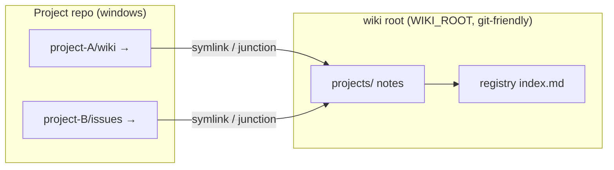
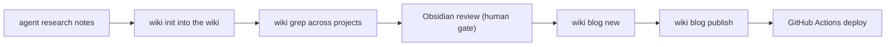
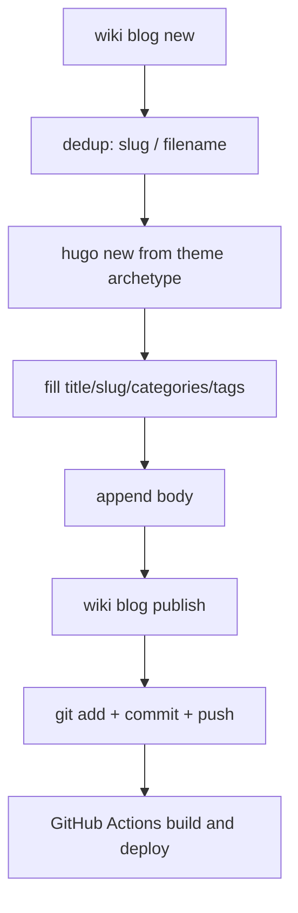

> [中文版](design.md)

# Design

> my-wiki is not “yet another notes app”. It is an auto-synchronizer inside an agent workflow. Design centers on a **single hook**: session-end `wiki check` covers all maintenance — windows for registered projects, note migration, registry sync; unregistered projects that already have knowledge dirs are auto-inverted (move into the wiki + window in place). Idempotent, silent, non-blocking. Neither humans nor agents need to remember “enroll”.

Auto-invert runs at session end, not session start, on purpose: invert requires “the project already has a knowledge dir” — i.e. the agent actually wrote during the session. At session start nothing has happened yet; creating dirs then only makes empty shells. Invert on demand at exit; no knowledge dir means a complete no-op.

## Core idea: hook-driven, automation first

Hook-driven design splits the system into two layers:

- **Data plane**: the notes themselves. Live layout is **scheme C (inverted storage)**: notes live under the wiki root at `projects/<project>/` (real files, git-friendly); project-side `wiki/`, `issues/`, etc. are windows into the wiki. Registry, publish records, and config sit in `WIKI_ROOT`. Old scheme A (wiki-side forward links aggregating projects) is retired and migrated to C when found; scheme B is `wiki bundle` on-demand snapshots, not a daily layout
- **Control flow**: tool logic and agent workflow. Command contract, exit hook (`check`) plus optional manual repair (`prepare`), convention inject — open-source and upgradable, never mixed with data

The split shows up in wiki-root resolution:

```go
// internal/config/config.go (simplified)
func WikiRoot() string {
    if env := os.Getenv("WIKI_ROOT"); env != "" {
        return env
    }
    // Probe exe dir, then cwd, for an index.md marker
    for _, dir := range []string{exeDir, cwd} {
        if _, err := os.Stat(filepath.Join(dir, "index.md")); err == nil {
            return dir
        }
    }
    return exeDir // fallback
}
```

> The tool repo can be public (code + conventions). Personal data lives where `WIKI_ROOT` points. Clone the wiki on a new machine, then `wiki prepare` + `wiki sync --fix` rebuild project-side windows.

Data-plane rule: **registry is centralized, notes live in the wiki**. Enrollment lives only in wiki-root `index.md`; notes are real dirs under `projects/`, git-friendly. The project side keeps windows; `projectGitignore` default true writes knowledge dirs into the project `.gitignore` so they are not committed by accident.

## Data plane: three layouts, only C is daily

The letters are evolution codes, not three peer options:

| | **A forward aggregation** | **C inverted storage** | **B on-demand archive** |
|---|---|---|---|
| Status | Retired. `legacyForward`: wiki side is a link to the project’s real dir | **Live.** `invertedHealthy`: real dirs on the wiki side, windows on the project | A command, not a live layout |
| Notes | Each project repo | Real files under `projects/<project>/` | Tree / zip / tgz cloned from C |
| Trigger | Leftover installs; `ensureInverted` finds them and `migrateInvert` | `wiki init` / `check` (`prepare` only repairs registered projects) | Manual `wiki bundle`, no hook |
| Why dropped / kept | git can only commit links; a new machine breaks them; Obsidian follows the links | git-friendly, Obsidian reads real files, agent paths unchanged | Cross-machine copy, offline backup; packing resolves windows into real files |

Docs and hooks only describe C: A is migrated away, B is an exit from C. Inside C, `--mode link|copy` chooses the project-side shape (next section). Do not treat link/copy as scheme D.

The registry persists as a hidden JSON block at the top of `index.md`; the rest is a rendered view:

```go
// internal/registry/registry.go
func saveRegistry(root string, reg *Registry) error {
    var b strings.Builder
    b.WriteString("<!-- wiki-registry\n")
    b.Write(data)                 // ← JSON (machine)
    b.WriteString("\n-->\n\n")
    b.WriteString("# 项目索引\n\n") // ← Markdown view (human)
    for _, p := range reg.Projects {
        fmt.Fprintf(&b, "| %s | %s | %s |\n", p.Name, p.Root, p.Intro)
    }
    return os.WriteFile(registryPath(root), []byte(b.String()), 0o644)
}
```

> One file is both data source and view; agents and humans can both read it. JSON sits in an HTML comment, so Markdown renderers hide it and `wiki grep` is not polluted by it.

Storage (scheme C): `projects/<project>/wiki` etc. are **real directories** (git-trackable); project-side `wiki/` etc. are **windows** (symlink/junction into the wiki). `wiki init` / `wiki sync --fix` migrate existing notes first, then replace with a window:

```go
// internal/registry/store.go (simplified)
func ensureInverted(store, projPath string, provision bool) (bool, error) {
    if invertedHealthy(store, projPath) { return false, nil }
    // project side is a real dir → migrateInvert: copy notes to store, then createLink(store, projPath)
    // wiki already has notes, project side missing → createLink(store, projPath)
    // provision=true and neither side exists → MkdirAll(store) + createLink
    ...
}
```

Windows without symlink permission falls back to junctions (`makeLink`). If the wiki side is still a forward link to the project (scheme A), the same path moves the notes out first, then installs a window.

**Scheme B (on-demand backup)** is not another daily store: `wiki bundle` clones `projects/` as a real tree, optionally zip/tgz — no hook, no change to project windows. Archives work for both C link and copy.

## Inside C: window vs incremental copy

Scheme C always puts notes under `projects/<project>/`. **link / copy are project-side shapes inside C**, chosen per project at enroll (`wiki init --mode copy|link`, or `defaultMode`). They are not a third layout next to A/B:

| | **link** (default) | **copy** |
|---|---|---|
| Project shape | Window (symlink/junction) → wiki | Real directory |
| Wiki side | Single canonical copy; agent writes through the window | Incremental merge copy of project notes |
| Sync | None (physically the same files) | check hook incremental sync: copy adds/edits only, newer mtime wins, **never deletes** |
| Git ownership of notes | Wiki repo (`projectGitignore` writes knowledge dirs into the project `.gitignore` by default) | Project repo (copy mode never touches project `.gitignore`) |
| Obsidian edits | Land on the canonical files | Kept — wiki-side updates are not overwritten by older project copies |
| Symlink needed | Yes (Windows falls back to junction) | No |
| `bundle` / `grep` | Transparent (both act on `projects/`) | Transparent |

Copy sync is **one-way merge**: project → wiki copies new and changed files; wiki-side edits (Obsidian review) stay because their mtime is newer; files deleted on the project side **remain** in the wiki — intentional (notes must not vanish quietly), at the cost of leftover files. Decision matches `rsync -u`: copy when the target is missing or the source mtime is newer; after copy the target mtime is now; unchanged files are zero-copy, even with many small files.

**When to use which:**

- **link (default)**: notes belong only to the wiki; you do not want two copies; Windows junctions are acceptable. Most projects.
- **copy**: you maintain the project repo and want notes committed/synced with it; or the environment cannot make symlinks; or Obsidian review should stay independent instead of punching through a link

Both modes are fixed at first enroll: repeating `init --mode` on a registered project warns and keeps the old mode. Switch with `wiki unlink` then `init`. Copy refuses to touch leftover link layouts (either side is a link) to avoid clobbering a migration.

Overall:



## Control flow: built for the hook

Control flow answers: how do hooks and agents work with this tool? Three designs run through it.

**Single hook: `check` does everything.** Safety contract:

- stdout is always empty (some tools treat stdout as strict JSON)
- all logs go to stderr; internal errors do not change the exit code

| Command | When | Role |
|---|---|---|
| `wiki check` | Session end (the only hook) | Registered projects: maintain windows, migrate notes, sync registry; wiki-sync declaration blocks auto-enroll; unregistered + existing knowledge dirs → auto-enroll (write registry; later sessions follow it). Behavior follows `defaultMode`: `link` = invert (move + window), `copy` = simple copy (project keeps real dirs, incremental merge) |
| `wiki prepare` | Anytime (optional, manual) | Registered projects: create/repair windows; no new enrollments |

Scope is `hookMode`: `forbiddenList` (default; skip `forbiddenPaths` and any descendant) or `whitelist` (only `includePaths` descendants); skips log a reason to stderr. Auto-invert rejects same-name registry conflicts (same basename, different roots) so it never overwrites an explicit `init`.

```go
// internal/registry/registry.go
// EnsureRegistered enrolls/syncs idempotently; shared by init/prepare/check
func EnsureRegistered(root, abs string, decl *WikiSyncDecl) (*EnsureResult, error) {
    // 1. ensureInverted: migrate notes + create project-side window
    // 2. on declaration shrink, drop windows only; wiki real dirs stay
    // 3. optional project .gitignore (projectGitignore)
    // 4. upsert registry — skip write if unchanged
    ...
}
```

> Important: no registry write if nothing changed. Otherwise every session end dirties the git worktree.

**Lenient flag parse.** Agents often put positionals before flags (`init <dir> --paths wiki`); the stdlib flag package rejects that. `ParseWithPositionals` reorders to “flags first, positionals last” then hands off to a standard FlagSet:

```go
// internal/cli/cli.go
func ParseWithPositionals(fs *flag.FlagSet, args []string) error {
    var flags, pos []string
    for i := 0; i < len(args); i++ {
        a := args[i]
        if strings.HasPrefix(a, "-") && a != "-" {
            flags = append(flags, a)
            if f := fs.Lookup(strings.TrimLeft(a, "-")); f != nil {
                if bv, ok := f.Value.(interface{ IsBoolFlag() bool }); !ok || !bv.IsBoolFlag() {
                    if i+1 < len(args) { // non-bool flags consume the next token
                        i++
                        flags = append(flags, args[i])
                    }
                }
            }
        } else {
            pos = append(pos, a)
        }
    }
    return fs.Parse(append(flags, pos...))
}
```

> This function is the agent-friendly design in miniature: the CLI caller is an LLM, not a human. LLMs do not strictly put flags first; lenient parse cuts failed retries.

## Two exits: Obsidian review + Hugo publish

> Two exits: an Obsidian vault (humans read and review) and a Hugo blog repo (public publish). Obsidian vault root = wiki root; `projects/` is real files, indexed directly. Only notes that pass review enter the blog pipeline.



**Obsidian is the reader.** Notes live in `projects/<project>/`; agents write through project-side windows; Obsidian reads at the wiki root. That is the only human gate. Setup: [obsidian.en.md](obsidian.en.md).

**Blog publish is a pipeline, not handicraft.** `blog new` automates the mechanical steps of creating a post:



Decisions on this pipeline:

**Dedup at apply.** Rare slug clash + existing filename fail before `hugo new`, so you never get a half-created conflict:

```go
// internal/blog/blog.go (cmdBlogNew)
posts, err := collectPosts(postDir) // scan posts, parse each front matter
...
for _, p := range posts {
    if p.Slug == normSlug {
        return fmt.Errorf("slug %q 已被 %s 使用，请换一个", normSlug, p.File)
    }
    if p.File == fileName+".md" {
        return fmt.Errorf("文件 %s.md 已存在", fileName)
    }
}
```

**Templates belong to the theme.** `hugo new` generates a full template from the theme archetype. Theme fields (`musicid`/`image`/…) stay with the theme; the CLI fills four fields + body — theme upgrades do not break the CLI, CLI upgrades do not touch the theme:

```go
// internal/blog/blog.go
// runHugoNew calls `hugo new <rel>` so the theme archetype writes a full front matter template.
// Package-level var is a test seam: unit/E2E tests mock it, no real hugo required.
var runHugoNew = func(hugoBin, siteDir, rel string) error { ... }
```

**No retry on push failure.** Raw error is passed through; the article is already committed locally; the user pushes once by hand:

```go
// internal/blog/blog.go (blogPublish)
if out, _, err := run("push", "push"); err != nil {
    return fmt.Errorf(
        "git push 失败（不重试，原始输出透传如下）:\n%s%v\n\n"+
            "GitHub 网络问题请用户手动处理：稍后在 %s 执行 git push 即可，文章已本地提交。",
        out, err, repo)
}
```

> No retry is deliberate: push failures are almost always network/proxy; auto-retry only amplifies GitHub rate limits. Leaving the decision to a human is more reliable than pretending to be smart.

**`blog.json` is lazy.** The publish record updates four fields only after a successful publish. First `blog list` scans the Hugo posts dir to bootstrap; afterwards it reconciles by filename — no full rescan, no re-parse of already-recorded files:

```go
// internal/blog/record.go
// reconcileRecord incrementally reconciles by filename against the Hugo posts dir
// (lazy: already-recorded files are not re-parsed).
func reconcileRecord(root, postDir string) (*BlogRecord, error) {
    ...
    if known[en.Name()] {
        continue // skip recorded files
    }
    ...
}
```

**`blog list` feeds knowledge management.** The record aggregates category/tag frequency; new posts reuse existing labels — categories do not fragment, wiki metadata directly guides writing:

```go
// internal/blog/blog.go (cmdBlogList)
cats := aggregate(rec, func(e BlogRecEntry) []string { return e.Categories })
...
fmt.Println("categories（按使用次数降序，创建文章时优先复用已有类别）:")
```

> Split of the two exits: Obsidian makes it comfortable for humans; Hugo makes it shippable. The human gate between them is the most important design decision on this pipeline — agents produce and do the mechanical work; humans judge.

## Repository layout

```
cmd/wiki/            entry: subcommand dispatch and usage
internal/cli/        shared helpers (lenient flag parse, string/path utils)
internal/config/     wiki-root resolution, config.json, knowledgeDirs, blog repo
internal/registry/   core domain: registry, inverted storage, prepare/check/bundle
internal/view/       global view: ls / tree / grep / cat
internal/blog/       blog pipeline: front matter, publish record, new/publish
internal/guide/      convention inject (wiki inject)
AGENTS.md            agent contract (commands and workflow boundaries)
docs/                HUMAN_GUIDE / AGENT_GUIDE, design, workflow, Obsidian setup
```
