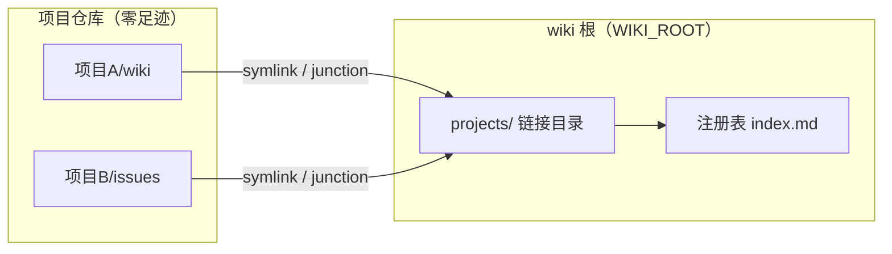

# 设计文档

> my-wiki 的定位不是"又一个笔记工具"，而是 agent 工作流里的自动同步器。设计围绕一个心跳展开：会话退出（/quit）时，钩子跑一次 `wiki check`——幂等、静默、非阻塞，把项目 wiki 知识自动收进知识库。人不需要记得"接入"这件事，agent 也不需要。

## 核心思想：hook 驱动，自动化优先

hook 驱动的前提是架构分层，整个系统切成两层：

- **数据面**：知识数据本身。笔记留在各自项目里（单一事实源），注册表、发布记录、配置在 `WIKI_ROOT` 指向的本地目录，`projects/` 链接是机器本地的视图
- **控制流**：工具逻辑与 agent 工作流。命令契约、钩子、规约注入——这部分可以开源、可以复制、可以升级，和数据互不污染

分离的直接体现是 wiki 根解析：

```go
// internal/config/config.go（简化）
func WikiRoot() string {
    if env := os.Getenv("WIKI_ROOT"); env != "" {
        return env
    }
    // 依次探测可执行文件目录、当前目录是否含 index.md 标记
    for _, dir := range []string{exeDir, cwd} {
        if _, err := os.Stat(filepath.Join(dir, "index.md")); err == nil {
            return dir
        }
    }
    return exeDir // 兜底
}
```

> 工具仓库可以开源（代码 + 规约），个人数据在 `WIKI_ROOT` 指向的目录，两者互不污染。换机器只要把数据目录拷过去，`projects/` 链接重建一次即可。

数据面还有一个更重要的原则：**项目仓库零足迹**。接入信息只存在 wiki 根的本地注册表，不会随项目 commit/push 泄漏到远程——个人知识配置永远不会出现在公开仓库里。

## 数据面实现：注册表 + 目录链接

注册表持久化为 `index.md` 顶部的隐藏 JSON 块，其余是渲染视图：

```go
// internal/registry/registry.go
func saveRegistry(root string, reg *Registry) error {
    var b strings.Builder
    b.WriteString("<!-- wiki-registry\n")
    b.Write(data)                 // ← JSON 数据块（机器读）
    b.WriteString("\n-->\n\n")
    b.WriteString("# 项目索引\n\n") // ← 以下是 Markdown 渲染视图（人读）
    for _, p := range reg.Projects {
        fmt.Fprintf(&b, "| %s | %s | %s |\n", p.Name, p.Root, p.Intro)
    }
    return os.WriteFile(registryPath(root), []byte(b.String()), 0o644)
}
```

> 一个文件同时是数据源和视图，agent 和人都能读。JSON 藏在 HTML 注释里，Markdown 渲染器不会显示它，`wiki grep` 也不会被它干扰。

链接层：`projects/<项目>/` 下建 symlink 指向项目的 wiki/issues 目录，Windows 无权限时自动降级 junction：

```go
// internal/registry/registry.go
func makeLink(target, link string) error {
    if err := os.Symlink(target, link); err == nil {
        return nil
    } else if runtime.GOOS == "windows" {
        out, jerr := exec.Command("cmd", "/c", "mklink", "/J", link, target).CombinedOutput()
        if jerr == nil {
            return nil // ← junction 降级成功
        }
        return fmt.Errorf("symlink 失败: %v；junction 降级也失败: %v: %s", err, jerr, out)
    }
    return err
}
```

整体关系：



## 控制流实现：为 hook 而生

控制流要回答一个问题：hook 和 agent 怎么和这个工具协作？两个设计贯穿始终。

**幂等 check，为钩子而生。** `wiki check` 被设计为对任何钩子机制都安全：

- stdout 恒为空（部分工具会把 stdout 当 JSON 严格校验）
- 日志全部走 stderr，内部错误不改变退出码
- 不修改当前项目仓库的任何文件

```go
// internal/registry/registry.go
// EnsureRegistered 幂等地把项目接入知识库，init/register/check 共用
func EnsureRegistered(root, abs string, decl *WikiSyncDecl) (*EnsureResult, error) {
    // 1. 跳过健康链接（EvalSymlinks 比对目标）
    // 2. 修复失效链接
    // 3. 清理声明收缩后的孤儿链接（只删链接，绝不碰真实目录）
    // 4. upsert 注册表——无变化则不写盘
    ...
}
```

> 关键细节：注册表无变化则不写盘。否则每次会话退出都触发一次文件写入，既制造噪音，也让 git 工作区永远不干净。

**宽容 flag 解析。** agent 调用 CLI 时经常把位置参数放在旗标前（`init <目录> --paths wiki`），标准库 flag 不接受这种顺序。`ParseWithPositionals` 内部重排为「旗标在前、位置参数在后」再交给标准 FlagSet：

```go
// internal/cli/cli.go
func ParseWithPositionals(fs *flag.FlagSet, args []string) error {
    var flags, pos []string
    for i := 0; i < len(args); i++ {
        a := args[i]
        if strings.HasPrefix(a, "-") && a != "-" {
            flags = append(flags, a)
            if f := fs.Lookup(strings.TrimLeft(a, "-")); f != nil {
                if bv, ok := f.Value.(interface{ IsBoolFlag() bool }); !ok || !bv.IsBoolFlag() {
                    if i+1 < len(args) { // 非 bool 旗标吞掉下一个 token
                        i++
                        flags = append(flags, args[i])
                    }
                }
            }
        } else {
            pos = append(pos, a)
        }
    }
    return fs.Parse(append(flags, pos...))
}
```

> 这个函数是 agent 友好设计的缩影：CLI 的调用方是 LLM，不是人。LLM 生成命令时不会严格遵守「旗标在前」的约定，宽容解析能显著减少失败重试。