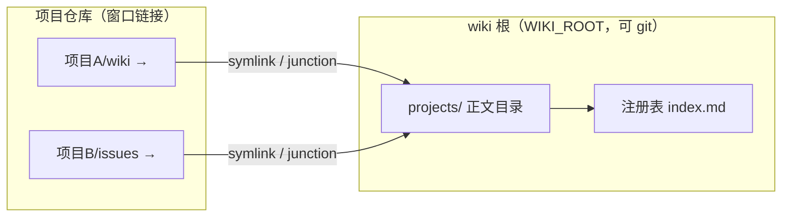
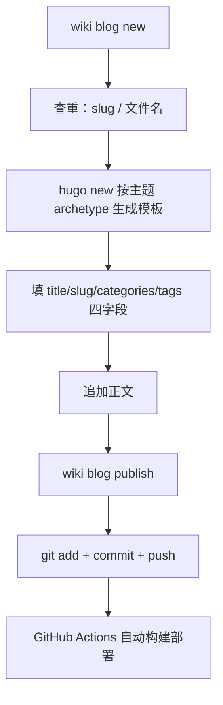

# 设计文档

> my-wiki 的定位不是"又一个笔记工具"，而是 agent 工作流里的自动同步器。设计围绕**单 hook** 展开：会话退出跑 `wiki check`，它覆盖全部维护——已注册项目维护窗口、迁移正文、同步注册表；未注册项目若已有知识目录则自动反转（迁入知识库 + 原位建窗口链接）。幂等、静默、非阻塞。人不需要记得"接入"这件事，agent 也不需要。

自动反转放在会话退出而不是会话开始，是时序上的刻意选择：反转的前提是"项目里已有知识目录"——即 agent 在会话中真实写入过。会话开始时什么都还没发生，主动创建目录只会制造空壳；会话退出时按需反转，没有知识目录就完全无感。

## 核心思想：hook 驱动，自动化优先

hook 驱动的前提是架构分层，整个系统切成两层：

- **数据面**：知识数据本身。现行布局是**方案 C（反转存储）**：正文落在 wiki 根 `projects/<项目>/`（真文件，可进 git）；项目侧 `wiki/`、`issues/` 等为指向知识库的窗口链接。注册表、发布记录、配置在 `WIKI_ROOT`。旧版方案 A（知识库正向链接去聚合项目）已退役，遇到即迁到 C；方案 B 是 `wiki bundle` 按需快照，不是日常布局
- **控制流**：工具逻辑与 agent 工作流。命令契约、退出 hook（check）与可选手动修复（prepare）、规约注入——可开源、可升级，和数据互不污染

分离的直接体现是 wiki 根解析：

```go
// internal/config/config.go（简化）
func WikiRoot() string {
    if env := os.Getenv("WIKI_ROOT"); env != "" {
        return env
    }
    // 依次探测可执行文件目录、当前目录是否含 index.md 标记
    for _, dir := range []string{exeDir, cwd} {
        if _, err := os.Stat(filepath.Join(dir, "index.md")); err == nil {
            return dir
        }
    }
    return exeDir // 兜底
}
```

> 工具仓库可以开源（代码 + 规约），个人数据在 `WIKI_ROOT` 指向的目录，两者互不污染。换机器 clone 知识库仓后，`wiki prepare` + `wiki sync --fix` 重建项目侧窗口链接即可。

数据面原则：**注册表集中、正文在知识库**。接入信息只存在 wiki 根的 `index.md`；知识正文在 `projects/` 真目录，git 友好。项目侧只留窗口链接，`projectGitignore` 默认 true 会把知识目录写入项目 `.gitignore`，避免误提交。

## 数据面实现：三种布局，日常只用 C

字母是演进代号，不是三套并列选项：

| | **A 正向聚合** | **C 反转存储** | **B 按需归档** |
|---|---|---|---|
| 状态 | 已退役。`legacyForward`：知识库侧是指向项目真目录的链接 | **现行。** `invertedHealthy`：知识库侧真目录，项目侧窗口链接 | 命令，不是活布局 |
| 知识正文 | 各项目仓 | `projects/<项目>/` 真文件 | 从 C 克隆出的目录树 / zip / tgz |
| 触发 | 旧安装残留；`ensureInverted` 发现后 `migrateInvert` | `wiki init` / `check`（prepare 仅修复已注册项目） | 手动 `wiki bundle`，不走 hook |
| 为何弃 / 留 | git 只能提交链接，Obsidian 也只能跟着链接走 | git 友好、Obsidian 直读真文件、agent 路径不变 | 跨机器拷贝、离线备份；打包时把窗口解析成真文件 |

所以文档和 hook 只围绕 C 写：A 会自动迁走，B 是 C 的出口。C 内部再用 `--mode link|copy` 决定项目侧形态（见下一节），不要把 link/copy 理解成方案 D。

注册表持久化为 `index.md` 顶部的隐藏 JSON 块，其余是渲染视图：

```go
// internal/registry/registry.go
func saveRegistry(root string, reg *Registry) error {
    var b strings.Builder
    b.WriteString("<!-- wiki-registry\n")
    b.Write(data)                 // ← JSON 数据块（机器读）
    b.WriteString("\n-->\n\n")
    b.WriteString("# 项目索引\n\n") // ← 以下是 Markdown 渲染视图（人读）
    for _, p := range reg.Projects {
        fmt.Fprintf(&b, "| %s | %s | %s |\n", p.Name, p.Root, p.Intro)
    }
    return os.WriteFile(registryPath(root), []byte(b.String()), 0o644)
}
```

> 一个文件同时是数据源和视图，agent 和人都能读。JSON 藏在 HTML 注释里，Markdown 渲染器不会显示它，`wiki grep` 也不会被它干扰。

存储层（方案 C）：`projects/<项目>/wiki` 等是**真实目录**（git 可跟踪）；项目侧 `wiki/` 等是**窗口链接**（symlink/junction，指向知识库）。`wiki init` / `wiki sync --fix` 先迁移项目内已有正文，再替换为窗口：

```go
// internal/registry/store.go（简化）
func ensureInverted(store, projPath string, provision bool) (bool, error) {
    if invertedHealthy(store, projPath) { return false, nil }
    // 项目侧是真目录 → migrateInvert：先拷贝正文到 store，再 createLink(store, projPath)
    // 知识库已有正文、项目侧缺失 → createLink(store, projPath)
    // provision=true 且两侧都不存在 → MkdirAll(store) + createLink
    ...
}
```

Windows 无符号链接权限时自动降级 junction（`makeLink`）。若知识库侧仍是指向项目的正向链接（方案 A），同一条路径会先搬走正文、再换成窗口。

**方案 B（按需备份）** 不是另一种日常存储：`wiki bundle` 把 `projects/` 克隆为真实目录树，可选 zip/tgz——不走 hook、不改项目侧窗口。归档对 C 的 link/copy 两种模式通用。

## 方案 C 内部：窗口链接 vs 增量拷贝

方案 C 的知识正文统一落在 `projects/<项目>/`。**link / copy 是 C 内部的项目侧形态**，接入时按项目二选一（`wiki init --mode copy|link`，或 `defaultMode` 配置默认），不是和 A/B 并列的第三套布局：

| | **link 模式**（缺省） | **copy 模式** |
|---|---|---|
| 项目侧形态 | 窗口链接（symlink/junction）→ 知识库 | 真实目录 |
| 知识库侧 | 唯一正本，agent 经链接直写 | 项目正文的增量合并拷贝 |
| 同步机制 | 无需同步（物理上是同一份文件） | check hook 增量同步：只拷新增/修改，mtime 新者胜，**永不删文件** |
| 知识正文的 git 归属 | 知识库仓（`projectGitignore` 默认把知识目录写进项目 `.gitignore`） | 项目仓（拷贝模式不碰项目 `.gitignore`） |
| Obsidian 校对修改 | 直接落在正本 | 保留——知识库侧更新的文件不会被项目侧旧版本覆盖 |
| 符号链接依赖 | 有（Windows 无权限自动降级 junction） | 无 |
| `bundle` 归档 / `grep` 检索 | 透明支持（都作用在 `projects/` 上） | 透明支持 |

copy 模式的同步语义是**合并单向**：项目 → 知识库拷入新增和修改的文件；知识库侧的修改（Obsidian 校对）因 mtime 更新而保留；项目侧删除的文件在知识库**残留不删**——这是刻意设计（笔记不应悄悄消失），代价是知识库可能积累项目侧已删除的旧文件。判定与 `rsync -u` 一致：目标缺失或源 mtime 更晚才拷，拷贝后目标 mtime 为当前时间，未变更文件零拷贝，小文件多也不慢。

**适宜场景：**

- **link（缺省）**：知识只归知识库管、不想在项目里维护两份拷贝；Windows 环境可接受 junction。多数项目用这个
- **copy**：项目仓是自己维护的，希望知识正文随项目 git 一起提交/同步给协作者；或所在环境不便建符号链接；或希望 Obsidian 校对产物回流时项目侧保持独立不被链接穿透

两种模式都只在新接入时确定：已注册项目重复 `init --mode` 会告警并保留原模式，换模式需 `wiki unlink` 后重新 `init`。copy 模式遇残留链接布局（项目侧/知识库侧任一为链接）一律拒绝动手，防止错误覆盖搬迁。

整体关系：



## 控制流实现：为 hook 而生

控制流要回答一个问题：hook 和 agent 怎么和这个工具协作？三个设计贯穿始终。

**单 hook：check 一力承担。** 安全契约：

- stdout 恒为空（部分工具会把 stdout 当 JSON 严格校验）
- 日志全部走 stderr，内部错误不改变退出码

| 命令 | 时机 | 作用 |
|---|---|---|
| `wiki check` | 会话退出（唯一 hook） | 已注册项目：维护窗口、迁移正文、同步注册表；有 wiki-sync 声明块则自动接入；未注册且已有知识目录 → 自动反转（写注册表，后续会话按注册表维护） |
| `wiki prepare` | 任意时刻（可选，手动） | 已注册项目：建立/修复窗口链接，不创建新接入 |

生效范围由 `hookMode` 控制：`forbiddenList`（缺省，`forbiddenPaths` 禁止名单及其任意深度子孙跳过）或 `whitelist`（仅 `includePaths` 白名单子孙目录生效）；跳过时 stderr 输出原因。自动反转拒绝同名注册项冲突（不同根目录同名 basename），避免覆盖显式 init 的声明。

```go
// internal/registry/registry.go
// EnsureRegistered 幂等地接入/同步，init/prepare/check 共用
func EnsureRegistered(root, abs string, decl *WikiSyncDecl) (*EnsureResult, error) {
    // 1. ensureInverted：迁移正文 + 建立项目侧窗口链接
    // 2. 声明收缩时只摘窗口链接，知识库真目录保留
    // 3. 可选维护项目 .gitignore（projectGitignore）
    // 4. upsert 注册表——无变化则不写盘
    ...
}
```

> 关键细节：注册表无变化则不写盘。否则每次会话退出都触发一次文件写入，既制造噪音，也让 git 工作区永远不干净。

**宽容 flag 解析。** agent 调用 CLI 时经常把位置参数放在旗标前（`init <目录> --paths wiki`），标准库 flag 不接受这种顺序。`ParseWithPositionals` 内部重排为「旗标在前、位置参数在后」再交给标准 FlagSet：

```go
// internal/cli/cli.go
func ParseWithPositionals(fs *flag.FlagSet, args []string) error {
    var flags, pos []string
    for i := 0; i < len(args); i++ {
        a := args[i]
        if strings.HasPrefix(a, "-") && a != "-" {
            flags = append(flags, a)
            if f := fs.Lookup(strings.TrimLeft(a, "-")); f != nil {
                if bv, ok := f.Value.(interface{ IsBoolFlag() bool }); !ok || !bv.IsBoolFlag() {
                    if i+1 < len(args) { // 非 bool 旗标吞掉下一个 token
                        i++
                        flags = append(flags, args[i])
                    }
                }
            }
        } else {
            pos = append(pos, a)
        }
    }
    return fs.Parse(append(flags, pos...))
}
```

> 这个函数是 agent 友好设计的缩影：CLI 的调用方是 LLM，不是人。LLM 生成命令时不会严格遵守「旗标在前」的约定，宽容解析能显著减少失败重试。

## 知识库的两个出口：Obsidian 校对 + Hugo 发布

> 知识库有两个出口：Obsidian 仓库（人阅读校对）和 Hugo 博客仓库（对外发布）。Obsidian 仓库根 = wiki 根，`projects/` 下是真文件，直接索引；校对通过的笔记才进博客流水线。


**Obsidian 是阅读器。** 知识正文在 `projects/<项目>/`；agent 经项目侧窗口链接写入，Obsidian 在 wiki 根直接阅读校对。这是整条链路唯一的人工关卡。接入细节见 [obsidian.md](obsidian.md)。

**博客发布是流水线，不是手工活。** `blog new` 把创建文章的机械步骤全部自动化：



几个设计决策贯穿这条流水线：

**apply 时查重。** slug 罕见重复 + 文件名存在性，先于 `hugo new` 报错，避免生成一半才发现冲突：

```go
// internal/blog/blog.go（cmdBlogNew）
posts, err := collectPosts(postDir) // 扫描文章目录，解析每篇 front matter
...
for _, p := range posts {
    if p.Slug == normSlug {
        return fmt.Errorf("slug %q 已被 %s 使用，请换一个", normSlug, p.File)
    }
    if p.File == fileName+".md" {
        return fmt.Errorf("文件 %s.md 已存在", fileName)
    }
}
```

**模板归主题管。** `hugo new` 按主题 archetype 生成完整模板，主题字段（musicid/image 等）归主题管，CLI 只填四字段 + 拼正文——主题升级不破坏 CLI，CLI 升级不碰主题：

```go
// internal/blog/blog.go
// runHugoNew 调用 `hugo new <rel>` 让主题 archetype 生成完整 front matter 模板。
// 抽成包级变量是测试缝：单测/E2E 用 mock 替换，不依赖真实 hugo。
var runHugoNew = func(hugoBin, siteDir, rel string) error { ... }
```

**push 失败不重试。** 原始错误透传，文章已本地提交，用户手动补一次 push 即可：

```go
// internal/blog/blog.go（blogPublish）
if out, _, err := run("push", "push"); err != nil {
    return fmt.Errorf(
        "git push 失败（不重试，原始输出透传如下）:\n%s%v\n\n"+
            "GitHub 网络问题请用户手动处理：稍后在 %s 执行 git push 即可，文章已本地提交。",
        out, err, repo)
}
```

> 不重试是刻意的：push 失败几乎都是网络/代理问题，自动重试只会放大 GitHub 的限流压力。把决定权交给人，比假装智能地重试更可靠。

**blog.json 懒维护。** 发布记录只在发布成功后更新四字段；首次 `blog list` 扫描 Hugo 文章目录引导生成，之后按文件名增量对账——不重扫全量、不解析已记录文件：

```go
// internal/blog/record.go
// reconcileRecord 按文件名与 Hugo 文章目录增量对账（lazy：已记录的文件不重新解析）。
func reconcileRecord(root, postDir string) (*BlogRecord, error) {
    ...
    if known[en.Name()] {
        continue // 已记录的文件跳过
    }
    ...
}
```

**blog list 反哺知识管理。** 记录聚合出 categories/tags 词频，新文章优先复用已有类别——分类不会碎片化，知识库的元数据直接指导博客的写作决策：

```go
// internal/blog/blog.go（cmdBlogList）
cats := aggregate(rec, func(e BlogRecEntry) []string { return e.Categories })
...
fmt.Println("categories（按使用次数降序，创建文章时优先复用已有类别）:")
```

> 两个出口的分工：Obsidian 管「人看得舒服」，Hugo 管「对外发得出去」。中间夹的人工关卡（校对）是这条流水线最重要的设计决定——agent 负责产出和机械步骤，人负责判断。