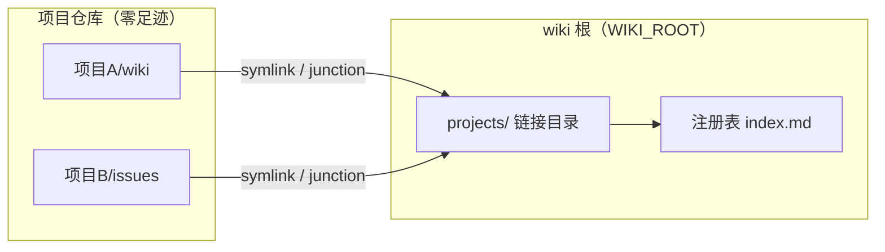
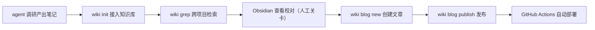
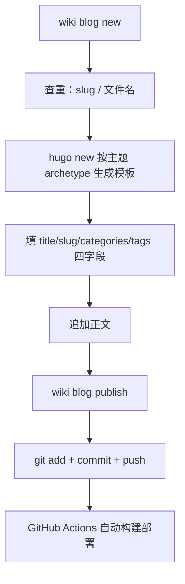

# 设计文档

> my-wiki 的定位不是"又一个笔记工具"，而是 agent 工作流里的自动同步器。设计围绕一个心跳展开：会话退出（/quit）时，钩子跑一次 `wiki check`——幂等、静默、非阻塞，把项目 wiki 知识自动收进知识库。人不需要记得"接入"这件事，agent 也不需要。

## 核心思想：hook 驱动，自动化优先

hook 驱动的前提是架构分层，整个系统切成两层：

- **数据面**：知识数据本身。笔记留在各自项目里（单一事实源），注册表、发布记录、配置在 `WIKI_ROOT` 指向的本地目录，`projects/` 链接是机器本地的视图
- **控制流**：工具逻辑与 agent 工作流。命令契约、钩子、规约注入——这部分可以开源、可以复制、可以升级，和数据互不污染

分离的直接体现是 wiki 根解析：

```go
// internal/config/config.go（简化）
func WikiRoot() string {
    if env := os.Getenv("WIKI_ROOT"); env != "" {
        return env
    }
    // 依次探测可执行文件目录、当前目录是否含 index.md 标记
    for _, dir := range []string{exeDir, cwd} {
        if _, err := os.Stat(filepath.Join(dir, "index.md")); err == nil {
            return dir
        }
    }
    return exeDir // 兜底
}
```

> 工具仓库可以开源（代码 + 规约），个人数据在 `WIKI_ROOT` 指向的目录，两者互不污染。换机器只要把数据目录拷过去，`projects/` 链接重建一次即可。

数据面还有一个更重要的原则：**项目仓库零足迹**。接入信息只存在 wiki 根的本地注册表，不会随项目 commit/push 泄漏到远程——个人知识配置永远不会出现在公开仓库里。

## 数据面实现：注册表 + 目录链接

注册表持久化为 `index.md` 顶部的隐藏 JSON 块，其余是渲染视图：

```go
// internal/registry/registry.go
func saveRegistry(root string, reg *Registry) error {
    var b strings.Builder
    b.WriteString("<!-- wiki-registry\n")
    b.Write(data)                 // ← JSON 数据块（机器读）
    b.WriteString("\n-->\n\n")
    b.WriteString("# 项目索引\n\n") // ← 以下是 Markdown 渲染视图（人读）
    for _, p := range reg.Projects {
        fmt.Fprintf(&b, "| %s | %s | %s |\n", p.Name, p.Root, p.Intro)
    }
    return os.WriteFile(registryPath(root), []byte(b.String()), 0o644)
}
```

> 一个文件同时是数据源和视图，agent 和人都能读。JSON 藏在 HTML 注释里，Markdown 渲染器不会显示它，`wiki grep` 也不会被它干扰。

链接层：`projects/<项目>/` 下建 symlink 指向项目的 wiki/issues 目录，Windows 无权限时自动降级 junction：

```go
// internal/registry/registry.go
func makeLink(target, link string) error {
    if err := os.Symlink(target, link); err == nil {
        return nil
    } else if runtime.GOOS == "windows" {
        out, jerr := exec.Command("cmd", "/c", "mklink", "/J", link, target).CombinedOutput()
        if jerr == nil {
            return nil // ← junction 降级成功
        }
        return fmt.Errorf("symlink 失败: %v；junction 降级也失败: %v: %s", err, jerr, out)
    }
    return err
}
```

整体关系：



## 控制流实现：为 hook 而生

控制流要回答一个问题：hook 和 agent 怎么和这个工具协作？两个设计贯穿始终。

**幂等 check，为钩子而生。** `wiki check` 被设计为对任何钩子机制都安全：

- stdout 恒为空（部分工具会把 stdout 当 JSON 严格校验）
- 日志全部走 stderr，内部错误不改变退出码
- 不修改当前项目仓库的任何文件

```go
// internal/registry/registry.go
// EnsureRegistered 幂等地把项目接入知识库，init/register/check 共用
func EnsureRegistered(root, abs string, decl *WikiSyncDecl) (*EnsureResult, error) {
    // 1. 跳过健康链接（EvalSymlinks 比对目标）
    // 2. 修复失效链接
    // 3. 清理声明收缩后的孤儿链接（只删链接，绝不碰真实目录）
    // 4. upsert 注册表——无变化则不写盘
    ...
}
```

> 关键细节：注册表无变化则不写盘。否则每次会话退出都触发一次文件写入，既制造噪音，也让 git 工作区永远不干净。

**宽容 flag 解析。** agent 调用 CLI 时经常把位置参数放在旗标前（`init <目录> --paths wiki`），标准库 flag 不接受这种顺序。`ParseWithPositionals` 内部重排为「旗标在前、位置参数在后」再交给标准 FlagSet：

```go
// internal/cli/cli.go
func ParseWithPositionals(fs *flag.FlagSet, args []string) error {
    var flags, pos []string
    for i := 0; i < len(args); i++ {
        a := args[i]
        if strings.HasPrefix(a, "-") && a != "-" {
            flags = append(flags, a)
            if f := fs.Lookup(strings.TrimLeft(a, "-")); f != nil {
                if bv, ok := f.Value.(interface{ IsBoolFlag() bool }); !ok || !bv.IsBoolFlag() {
                    if i+1 < len(args) { // 非 bool 旗标吞掉下一个 token
                        i++
                        flags = append(flags, args[i])
                    }
                }
            }
        } else {
            pos = append(pos, a)
        }
    }
    return fs.Parse(append(flags, pos...))
}
```

> 这个函数是 agent 友好设计的缩影：CLI 的调用方是 LLM，不是人。LLM 生成命令时不会严格遵守「旗标在前」的约定，宽容解析能显著减少失败重试。

## 知识库的两个出口：Obsidian 校对 + Hugo 发布

> 知识库有两个出口：Obsidian 仓库（人阅读校对）和 Hugo 博客仓库（对外发布）。Obsidian 仓库根就是 wiki 根，`projects/` 符号链接把各项目 wiki 聚合进来；校对通过的笔记才进博客流水线。调研笔记 → 知识库检索 → Obsidian 校对 → 沉淀成博客，一条链路：



**Obsidian 是阅读器，不是存储。** 笔记的单一事实源始终在项目自己的 `wiki/` 目录，Obsidian 仓库根 = wiki 根，通过 `projects/` 符号链接聚合出全局视图。人在 Obsidian 里校对：链接通不通、结论站不站得住、有没有遗漏。这是整条链路唯一的人工关卡——agent 产出再快，发布前必须过一遍人眼。接入细节见 [obsidian.md](obsidian.md)。

**博客发布是流水线，不是手工活。** `blog new` 把创建文章的机械步骤全部自动化：



几个设计决策贯穿这条流水线：

**apply 时查重。** slug 罕见重复 + 文件名存在性，先于 `hugo new` 报错，避免生成一半才发现冲突：

```go
// internal/blog/blog.go（cmdBlogNew）
posts, err := collectPosts(postDir) // 扫描文章目录，解析每篇 front matter
...
for _, p := range posts {
    if p.Slug == normSlug {
        return fmt.Errorf("slug %q 已被 %s 使用，请换一个", normSlug, p.File)
    }
    if p.File == fileName+".md" {
        return fmt.Errorf("文件 %s.md 已存在", fileName)
    }
}
```

**模板归主题管。** `hugo new` 按主题 archetype 生成完整模板，主题字段（musicid/image 等）归主题管，CLI 只填四字段 + 拼正文——主题升级不破坏 CLI，CLI 升级不碰主题：

```go
// internal/blog/blog.go
// runHugoNew 调用 `hugo new <rel>` 让主题 archetype 生成完整 front matter 模板。
// 抽成包级变量是测试缝：单测/E2E 用 mock 替换，不依赖真实 hugo。
var runHugoNew = func(hugoBin, siteDir, rel string) error { ... }
```

**push 失败不重试。** 原始错误透传，文章已本地提交，用户手动补一次 push 即可：

```go
// internal/blog/blog.go（blogPublish）
if out, _, err := run("push", "push"); err != nil {
    return fmt.Errorf(
        "git push 失败（不重试，原始输出透传如下）:\n%s%v\n\n"+
            "GitHub 网络问题请用户手动处理：稍后在 %s 执行 git push 即可，文章已本地提交。",
        out, err, repo)
}
```

> 不重试是刻意的：push 失败几乎都是网络/代理问题，自动重试只会放大 GitHub 的限流压力。把决定权交给人，比假装智能地重试更可靠。

**blog.json 懒维护。** 发布记录只在发布成功后更新四字段；首次 `blog list` 扫描 Hugo 文章目录引导生成，之后按文件名增量对账——不重扫全量、不解析已记录文件：

```go
// internal/blog/record.go
// reconcileRecord 按文件名与 Hugo 文章目录增量对账（lazy：已记录的文件不重新解析）。
func reconcileRecord(root, postDir string) (*BlogRecord, error) {
    ...
    if known[en.Name()] {
        continue // 已记录的文件跳过
    }
    ...
}
```

**blog list 反哺知识管理。** 记录聚合出 categories/tags 词频，新文章优先复用已有类别——分类不会碎片化，知识库的元数据直接指导博客的写作决策：

```go
// internal/blog/blog.go（cmdBlogList）
cats := aggregate(rec, func(e BlogRecEntry) []string { return e.Categories })
...
fmt.Println("categories（按使用次数降序，创建文章时优先复用已有类别）:")
```

> 两个出口的分工：Obsidian 管「人看得舒服」，Hugo 管「对外发得出去」。中间夹的人工关卡（校对）是这条流水线最重要的设计决定——agent 负责产出和机械步骤，人负责判断。