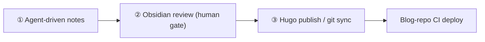
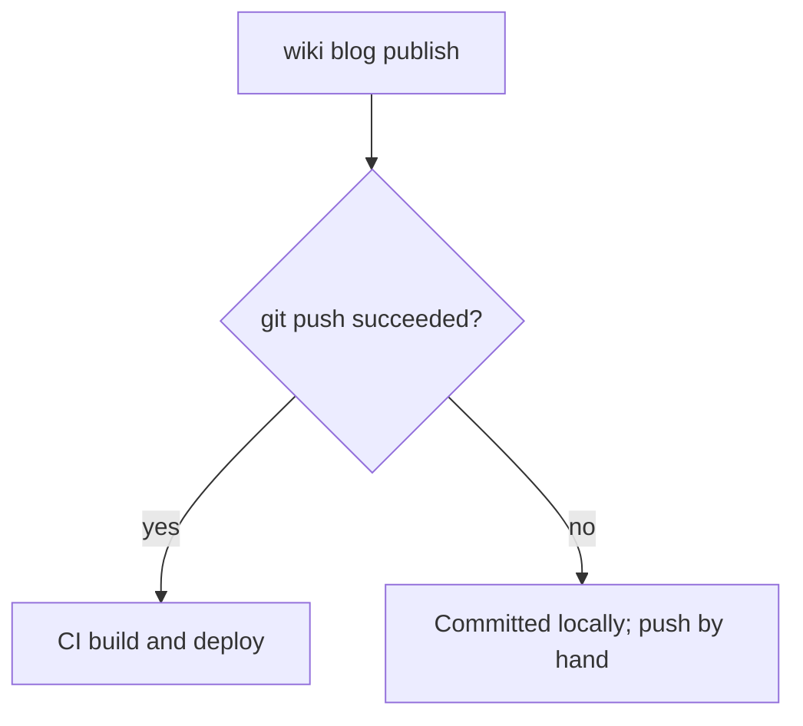

> [中文版](workflow.md)

# Knowledge workflow

> The tool answers “how it is stored”; the workflow answers “how you use it”. Three stages: agent-driven notes → Obsidian review → Hugo publish / git sync. Each stage has a clear artifact and handoff, with a human gate in the middle.

## Overview

## ① Agent-driven notes

After research or practice, the agent writes conclusions into the project `wiki/` directory. On session end, `wiki check` auto-inverts: notes move into `projects/<project>/wiki/` (scheme C inverted storage, git-friendly) and the original path becomes a window. If nothing was written, nothing happens. Use `wiki init` to declare paths/mode and fill metadata; afterwards `check` maintains from the registry:

- **Session end** `wiki check` (the only hook): maintain windows, migrate new notes, sync the registry, auto-invert unregistered projects on demand

Agent paths stay the same (`wiki/note.md`); nobody maintains links by hand.

## ② Obsidian review

The knowledge base is meant to be read by people. Obsidian vault root = wiki root; `projects/` holds **real files** per project, indexed directly, no extra symlinks. A human reads and reviews in Obsidian: is the structure clear, do the conclusions hold, what is missing. This is the only human gate on the pipeline — however fast the agent produces, it does not ship before a pair of eyes.

Setup: [obsidian.en.md](obsidian.en.md).

## ③ Hugo publish / git sync

Publish is `wiki blog new` → `wiki blog publish`. A successful push triggers the blog repo CI’s hugo build. Failure handling is deliberate:

No retry on push failure — almost always network/proxy; auto-retry would only amplify rate limits.

**Wiki git sync**: push `projects/` notes plus `index.md` to a private remote. After cloning on a new machine, run `wiki sync --fix` (or `wiki prepare`) to rebuild project-side windows. On-demand backup: `wiki bundle [--archive zip|tgz]` (scheme B, a snapshot of C, not another daily layout).

> Three artifacts: notes (`projects/` in the wiki) → review judgment (a human) → published posts (blog repo). The human gate sits before publish, not after — that is the most important design decision on this pipeline.
