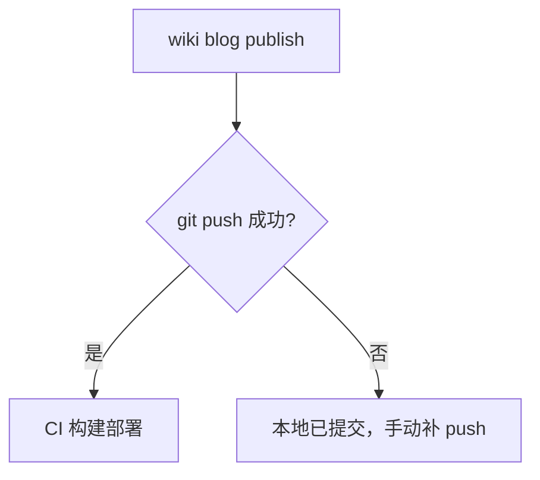

# 知识工作流

> 工具解决"怎么管"，工作流解决"怎么用"。整条链路三段：agent 驱动总结 → Obsidian 查看校对 → Hugo 发布 / git 同步。每段有明确的产出物和交接点，中间夹一道人工关卡。

## 总览

## ① Agent 驱动总结

agent 调研/实践后把结论写入项目 `wiki/` 窗口——正文实际落在知识库 `projects/<项目>/wiki/`（方案 C，可 git 同步）。首次 `wiki init` 接入并迁移已有正文；之后双 hook 自动维护：

- **会话开始** `wiki prepare`：建立/修复项目侧窗口链接
- **会话退出** `wiki check`：维护窗口、迁移新正文、同步注册表

agent 路径不变（仍写 `wiki/note.md`），不需要手动维护链接。

## ② Obsidian 查看校对

知识库最终要给人看。Obsidian 仓库根 = wiki 根，`projects/` 下是各项目知识**真文件**，直接索引，无需符号链接。人在 Obsidian 里阅读校对：结构是否清晰、结论站不站得住、有没有遗漏。这是整条链路唯一的人工关卡——agent 产出再快，发布前必须过一遍人眼。

接入步骤见 [obsidian.md](obsidian.md)。

## ③ Hugo 发布 / git 同步

发布走 `wiki blog new` → `wiki blog publish`，push 成功即触发博客仓库 CI 的 hugo 构建部署。失败处理是刻意的：

push 失败不重试——几乎都是网络/代理问题，自动重试只会放大限流。

**知识库 git 同步**：`projects/` 正文 + `index.md` 注册表一起 push 到 private remote；换机器 clone 后 `wiki prepare` 重建项目侧窗口。按需备份可用 `wiki bundle [--archive zip|tgz]`（方案 B）。

> 三段产出物：笔记（知识库 `projects/`）→ 校对结论（人脑）→ 已发布文章（博客仓库）。人工关卡放在发布前而不是发布后，是这条流水线最重要的设计决定。
