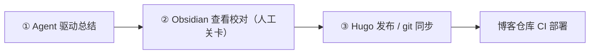
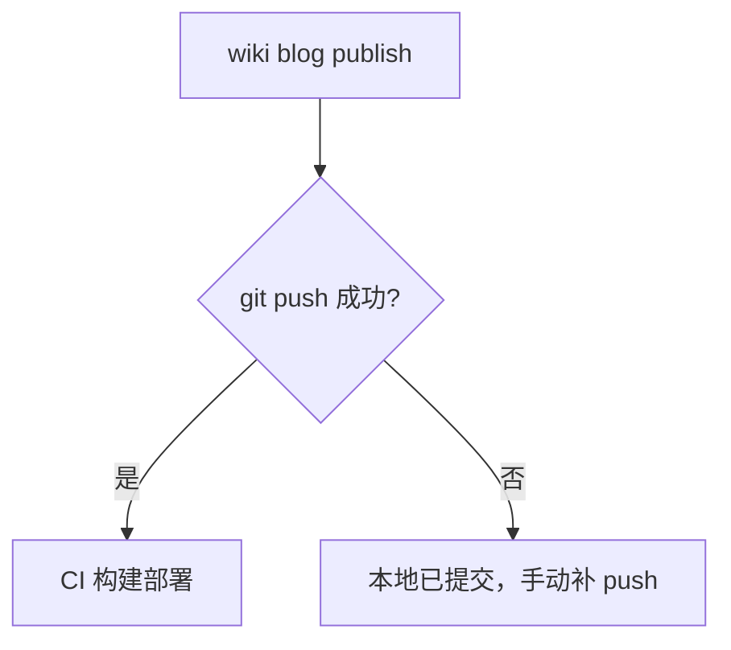

# 知识工作流

> 工具解决"怎么管"，工作流解决"怎么用"。整条链路三段：agent 驱动总结 → Obsidian 查看校对 → Hugo 发布 / git 同步。每段有明确的产出物和交接点，中间夹一道人工关卡。

## 总览

## ① Agent 驱动总结

agent 调研/实践后把结论沉淀成笔记，写入项目自己的 wiki/ 目录——单一事实源，笔记跟着项目走。接入零足迹：`wiki init` 只写本地注册表 + 建链接；钩子在会话退出时跑 `wiki check` 幂等同步，新笔记自动进知识库，不需要任何手动步骤。

## ② Obsidian 查看校对

知识库最终要给人看。Obsidian 仓库根 = wiki 根，`projects/` 下是各项目 wiki 的符号链接，人在 Obsidian 里阅读校对：链接通不通、结论站不站得住、有没有遗漏。这是整条链路唯一的人工关卡——agent 产出再快，发布前必须过一遍人眼。

这个环节的关键假设是符号链接可见，实测成立（Obsidian 官方支持 symlink，约束：目标与仓库根不相交、无循环）。接入步骤见 [obsidian.md](obsidian.md)。

## ③ Hugo 发布 / git 同步

发布走 `wiki blog new` → `wiki blog publish`，push 成功即触发博客仓库 CI 的 hugo 构建部署。失败处理是刻意的：

push 失败不重试——几乎都是网络/代理问题，自动重试只会放大限流。git 同步管理是兜底：先查代理（本地代理没启动时 push 必挂），再手动补 push。

> 三段产出物：笔记（项目 wiki/）→ 校对结论（人脑）→ 已发布文章（博客仓库）。交接点清晰，每段可独立重跑：agent 反复改笔记、人在 Obsidian 反复看、发布随时重来。人工关卡放在发布前而不是发布后，是这条流水线最重要的设计决定。